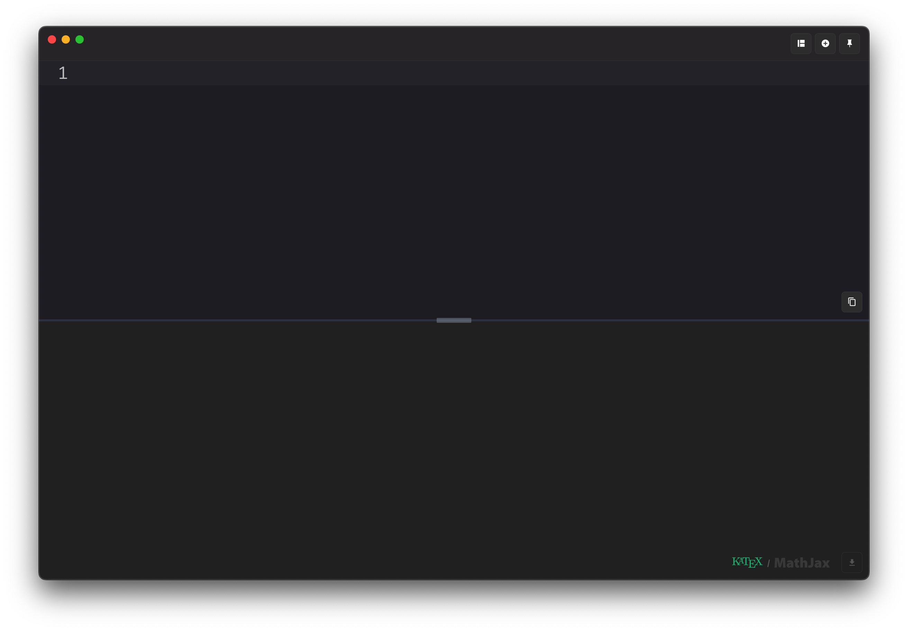
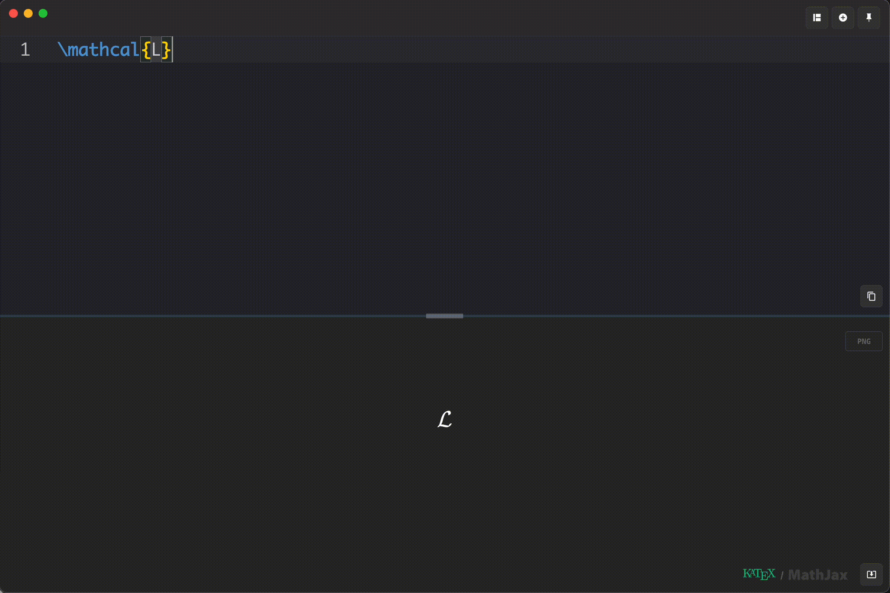
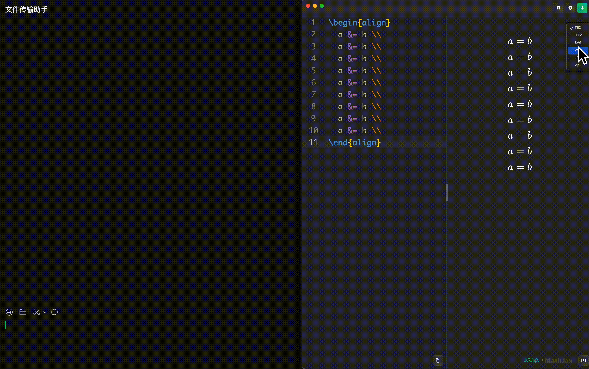
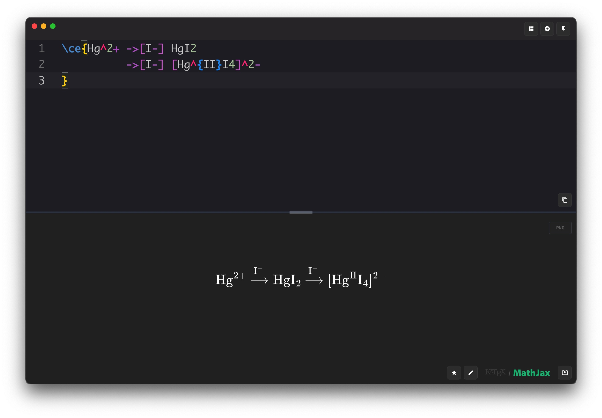
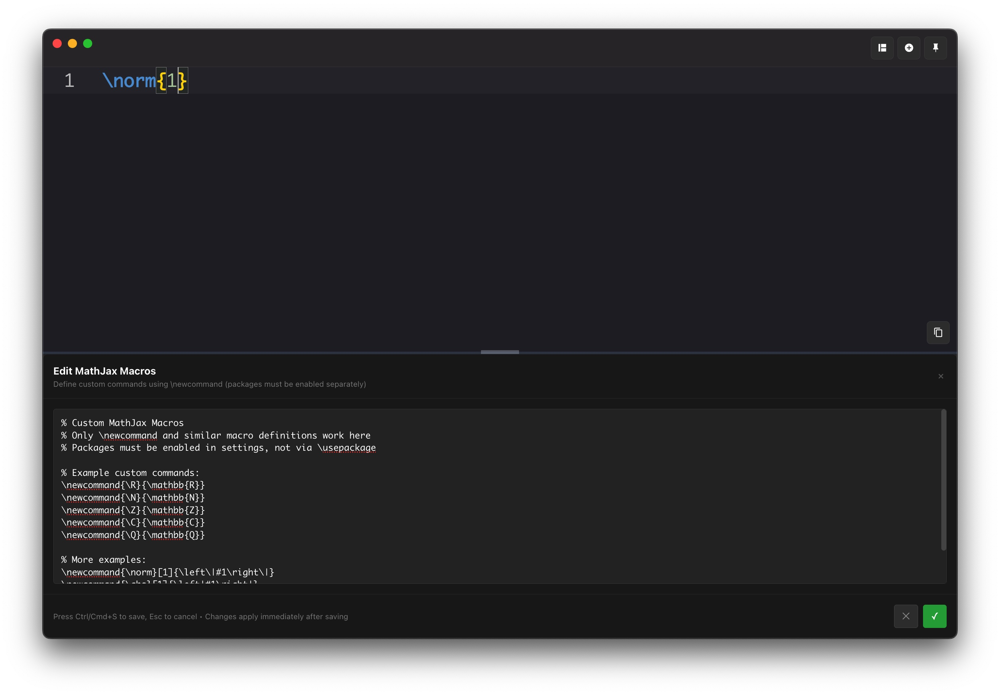
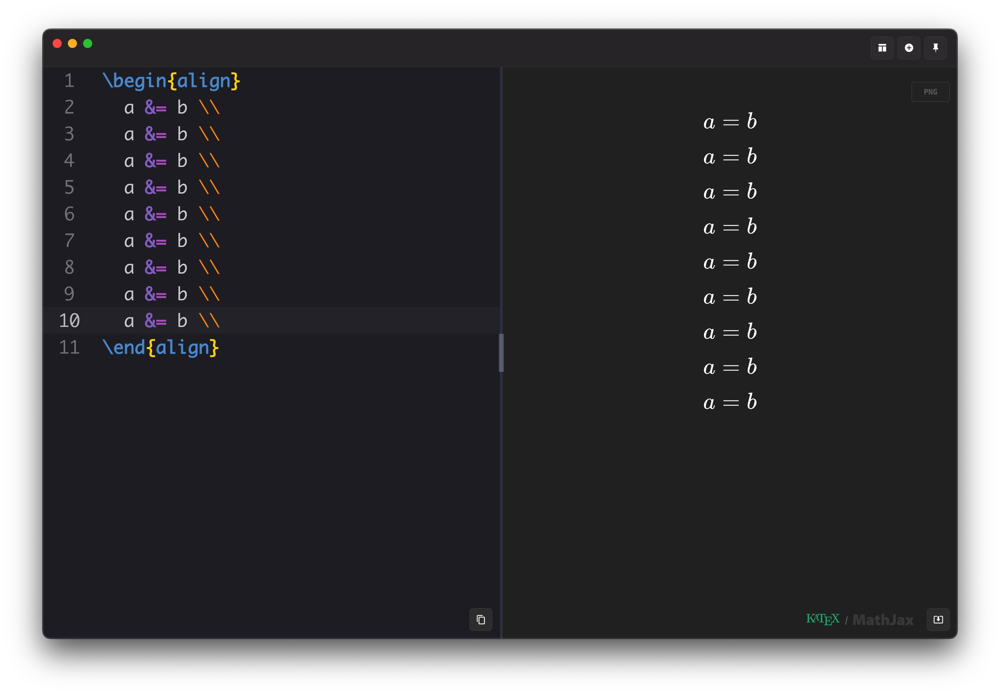

# TexFlow (测试版; vibe code 产品)

这是一款现代、轻量级的 LaTeX 方程式编辑器，具备即时预览、自动完成、快速导出等功能

## 📖 简介
本应用的开发目的**并非**替代常用的 LaTex 编辑器，而是作为特定场景下的**补充**
- 数学物理方面聊天讨论，快速输入 LaTeX 并拖动 `png`/`jpg` 公式到聊天窗口
- 使用思源笔记、word、wolai 等笔记软件录入数学公式时，提供更舒适的 LaTex 输入窗口
- 视频会议讨论通过分享屏幕快速交流数学表达式

## ✨ 主要特性

- **跨平台**
- **即时预览**：KaTex/MathJax 双引擎渲染
- **代码高亮**：轻松发现语法错误
- **自动完成**：常用 LaTex 指令和符号的下拉菜单补全
- **多光标编辑**：支持多光标编辑，快速修改多个位置的代码
- **自定义指令**：MathJax 模式下，支持 `\newcommand` 自定义宏指令，支持加载需要的 LaTex 包
  > 限于 MathJax 能支持的那些包
- **一键切换布局**：上下布局与左右布局自由切换
- **一键复制**：将 LaTeX 代码复制到剪贴簿
- **拖动导出**：鼠标拖拽即可导出选定格式文件
- **一键导出**：将渲染结果导出为 png 或 jpg
- **键盘优先**：常用快捷键支持，提升工作效率
- **一键悬浮**：工作时将 `TexFlow` 保持在其他视窗之上

## ⌨️ 键盘快捷键

| 快捷键 | 操作                                       |
| ------ | ------------------------------------------ |
| `⌘ C`  | 复制 LaTeX 到剪贴簿                        |
| `⌘ D`  | 将选取区段加入下一个寻找相符项，多光标编辑 |
| `⌘ U`  | 从目前的寻找相符项中移除选取区段           |
| `⌘ M`  | 将选取范围扩大至下一个括号                 |
| `⌘ Z`  | 撤销                                       |
| `⌘ Y`  | 恢复                                       |

## 🛠 Tech Stack

- **Electron** - 跨平台
- **Monaco Editor** - 具备 LaTeX 语言服务的专业代码编辑器
- **KaTeX/MathJax** - 极速/快速的数学符号渲染
- **React**
- **TypeScript**

## 🔮 Roadmap

- [ ] **持久化** - 宏、自定义包、最近 LaTex 代码的历史记录
- [ ] **导出格式** eps 支持
- [ ] **优化**：提高性能，减少体积
- [ ] **更多快捷键/指令** - 更好的自动完成、更多快捷键
- [ ] **主题** - 自定义 css

## 📄 License

MIT License - see [LICENSE](LICENSE) for details.

## 🤝 Contributing

We welcome contributions! Please see our [development guidelines](DEVELOPMENT_RULES.md) for more information.

---

  <strong>Made with ❤️ for the LaTeX community</strong> 
  <a href="https://github.com/panyw5/instex">⭐ Star us on GitHub</a>

