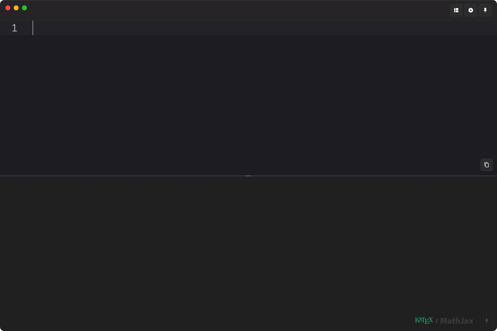
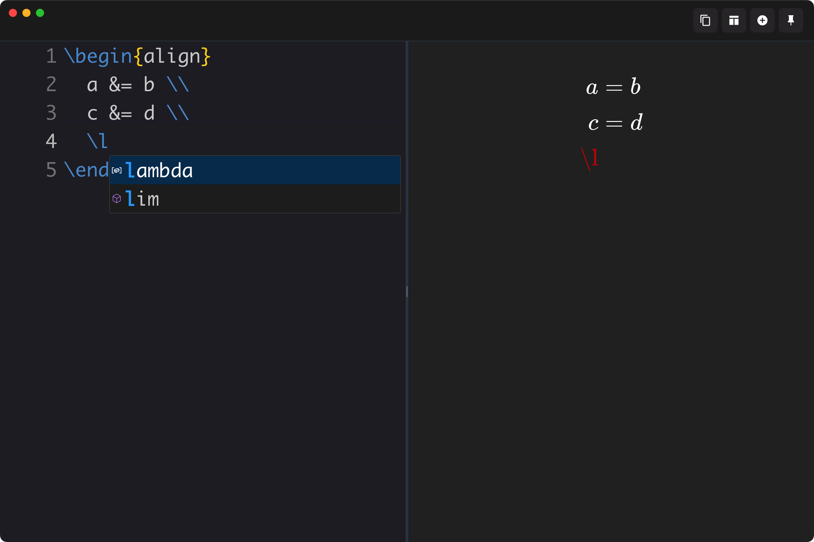

# TexFlow (beta)

> A modern, lightweight LaTeX equation editor with real-time preview and intelligent autocomplete



TexFlow is a professional LaTeX equation editor designed for mathematicians, scientists, and students who need to create beautiful mathematical expressions quickly and efficiently. Built with modern web technologies and powered by Monaco Editor and KaTeX, it delivers a seamless editing experience with instant visual feedback.

## ✨ Key Features

### 🚀 Real-Time Preview
- **Instant rendering** with KaTeX engine - see your equations come to life as you type
- **Synchronized editing** - changes appear immediately in the preview panel
- **Error highlighting** - instant feedback on syntax errors with helpful suggestions

### 🧠 Intelligent Autocomplete

- **Smart LaTeX suggestions** - context-aware command completion
- **Symbol picker** - quick access to mathematical symbols and operators
- **Environment completion** - automatic closing of LaTeX environments
- **Custom macros support** - define and reuse your own commands

### 🎨 Modern Interface
- **Clean two-panel design** - distraction-free editing environment
- **Adaptive layouts** - switch between horizontal and vertical split views
- **Dark/Light themes** - choose your preferred visual style
- **Syntax highlighting** - color-coded LaTeX commands for better readability

### ⚡ Productivity Features
- **Lightning-fast startup** - ready to use in seconds
- **Pin to top** - keep TexFlow above other windows while working
- **One-click copy** - instantly copy LaTeX code to clipboard
- **Keyboard-first design** - comprehensive shortcuts for power users

## 🔧 Supported LaTeX

TexFlow excels at mathematical content with comprehensive support for:

```latex
% Inline and display equations
$\sum_{i=1}^{n} x_i = \frac{n(n+1)}{2}$

% Complex mathematical expressions
$$\int_0^\infty e^{-x^2} dx = \frac{\sqrt{\pi}}{2}$$

% Advanced environments
\begin{align}
  \nabla \times \mathbf{E} &= -\frac{\partial \mathbf{B}}{\partial t} \\
  \nabla \times \mathbf{B} &= \mu_0\mathbf{J} + \mu_0\epsilon_0\frac{\partial \mathbf{E}}{\partial t}
\end{align}
```

**Supported Features:**
- Mathematical operators and symbols
- Fractions, superscripts, and subscripts  
- Matrix and array environments
- Equation and align environments
- Custom commands and macros

## ⌨️ Keyboard Shortcuts

| Shortcut | Action                                 |
| -------- | -------------------------------------- |
| `⌘⇧C`    | Copy LaTeX to clipboard                |
| `⌘⇧D`    | Add section to next find match         |
| `⌘⇧U`    | Remove section from current find match |
| `⌘Z`     | Undo                                   |
| `⌘Y`     | Redo                                   |

## 🚀 Getting Started

1. **Download** the latest release for macOS
2. **Install** by dragging to Applications folder
3. **Launch** TexFlow and start typing LaTeX
4. **Preview** updates automatically as you type

## 🛠 Technical Stack

- **Electron** - Cross-platform desktop framework
- **Monaco Editor** - Professional code editor with LaTeX language service
- **KaTeX** - Fast mathematical notation rendering
- **React** - Modern UI component architecture
- **TypeScript** - Type-safe development

## 🔮 Roadmap

- [ ] **Export capabilities** - PDF and PNG output
- [ ] **Document history** - version control for your equations
- [ ] **Custom preambles** - personalized LaTeX environments
- [ ] **Plugin system** - extend functionality with custom modules
- [ ] **Collaborative editing** - real-time collaboration features

## 📄 License

MIT License - see [LICENSE](LICENSE) for details.

## 🤝 Contributing

We welcome contributions! Please see our [development guidelines](DEVELOPMENT_RULES.md) for more information.

---

<p align="center">
  <strong>Made with ❤️ for the LaTeX community</strong><br>
  <a href="https://github.com/panyw5/instex">⭐ Star us on GitHub</a>
</p>
